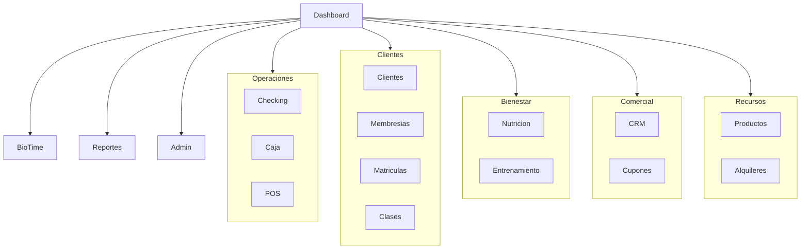

# Inventario de módulos — Gimnacio v1.1

Sistema monolito **Laravel 12 + Livewire/Flux/Volt**, multi-sucursal, orientado a operación de gimnasio (cobranza, acceso, bienestar, CRM y analítica). Los dominios viven en `app/Livewire`, `app/Services` y `app/Models/{Core|Crm|BioTime|System}`; no hay packages separados.

Fuente principal de navegación: [`resources/views/components/layouts/app/sidebar.blade.php`](../resources/views/components/layouts/app/sidebar.blade.php). Permisos: [`app/Support/PermissionCatalog.php`](../app/Support/PermissionCatalog.php).

---

## Inicio

| Módulo | Descripción |
| --- | --- |
| **Dashboard** | Panel de inicio operativo del sistema. |

---

## Operaciones

| Módulo | Descripción |
| --- | --- |
| **Checking** | Registro manual de ingresos/asistencias de clientes al gimnasio. |
| **Caja** | Apertura/cierre de caja, movimientos de efectivo y tickets. |
| **Punto de venta (POS)** | Ventas de productos, servicios, matrículas y alquileres. |
| **Ventas a crédito** | Gestión de ventas financiadas o a crédito. |
| **Cobros pendientes / CxC** | Cuentas por cobrar y cobros operativos pendientes. |
| **Comprobantes** | Generación de tickets/HTML/PDF de venta y pago. |
| **Cuotas (installments)** | Planes de cuotas de matrícula y su cobro. |

---

## BioTime (acceso biométrico)

| Módulo | Descripción |
| --- | --- |
| **BioTime Dashboard** | Estado de sincronización y visión general del acceso biométrico. |
| **Sedes BioTime** | Configuración/estado por sede. |
| **Mapeo** | Vinculación empleados/dispositivos BioTime ↔ clientes/sistema. |
| **Historial** | Historial de transacciones/eventos de acceso. |
| **API BioTime** | Endpoints de sync (`/api/biotime/*`: health, heartbeat, sync, config, commands, roster). |
| **biotime-bridge / poc** | Herramientas Python auxiliares en `tools/` para puente sede ↔ Laravel. |

---

## Clientes

| Módulo | Descripción |
| --- | --- |
| **Perfil de cliente** | Ficha 360° del cliente (comercial, bienestar, operación). |
| **Listado de clientes** | CRUD/listado de clientes (DNI/CE y datos de contacto). |
| **Membresías** | Catálogo de planes de membresía. |
| **Matrículas** | Contratos/asignaciones de membresías y clases a clientes. |
| **Clases** | Catálogo de clases grupales o programables. |
| **Contrato membresía PDF** | Generación/descarga de contrato (incl. URL firmada WhatsApp). |
| **ClienteMembresías (legacy)** | Compatibilidad de lectura/cobranza con el modelo legacy. |

---

## Bienestar

### Salud y nutrición

| Módulo | Descripción |
| --- | --- |
| **Gestión nutricional** | Medidas, evaluaciones, seguimiento nutricional y salud. |
| **Objetivos** | Definición y seguimiento de goals nutricionales. |
| **Calendario de citas** | Agenda de citas nutricionales. |

### Entrenamiento

| Módulo | Descripción |
| --- | --- |
| **Ejercicios** | Catálogo de ejercicios. |
| **Rutinas base** | Plantillas de rutinas y builder. |
| **Asignar rutina** | Asignación de rutinas a clientes. |
| **Sesiones de workout** | Registro de sesiones de entrenamiento. |
| **Progreso / Cumplimiento** | Reportes de avance y cumplimiento de rutinas. |

---

## Comercial

| Módulo | Descripción |
| --- | --- |
| **CRM Pipeline** | Kanban de leads por etapa. |
| **Leads** | Listado y detalle de prospectos. |
| **Tareas CRM** | Follow-ups y tareas comerciales. |
| **Oportunidades (Deals)** | Gestión de deals/ofertas. |
| **Campañas** | Campañas comerciales y su detalle. |
| **Etiquetas** | Tags de CRM y de clientes. |
| **Reportes CRM** | Analítica del embudo comercial. |
| **Renovación y reactivación** | Retención de clientes (renovar/reactivar). |
| **Mensajes WhatsApp** | Mensajería comercial vía WhatsApp. |
| **Cupones** | Descuentos y uso de cupones. |

---

## Recursos

| Módulo | Descripción |
| --- | --- |
| **Categorías de productos** | Catálogo de categorías. |
| **Productos** | Inventario/productos vendibles. |
| **Servicios** | Servicios externos o vendibles. |
| **Alquileres – operaciones** | Bandeja operativa del día (alquileres). |
| **Espacios rentables** | Catálogo de espacios alquilables. |
| **Calendario de alquileres** | Disponibilidad de espacios. |
| **Reservas** | Crear/editar/ver reservas de alquiler. |
| **Reporte ingresos alquiler** | Ingresos asociados a alquileres. |

---

## Analítica

| Módulo | Descripción |
| --- | --- |
| **Centro de reportes** | Hub de reportes del sistema. |
| **Reportes por dominio** | Ventas, matrículas, financiero, clientes, membresía/clases, usuarios, cajas, productos/servicios, gimnasio, CxC, cuotas vencidas. |
| **Export PDF/Excel** | Descargas de reportes (Maatwebsite Excel / mPDF). |
| **Reportes de evaluación** | Preview/descarga de evaluaciones físicas, historial y composición. |

---

## Administración

| Módulo | Descripción |
| --- | --- |
| **Empleados** | Gestión de personal. |
| **Asistencia de empleados** | Control y reportes de asistencia del staff. |
| **Métodos de pago** | Configuración de formas de cobro. |
| **Usuarios** | Cuentas de acceso al sistema. |
| **Roles y permisos** | RBAC con Spatie Permission. |
| **Settings de usuario** | Perfil, password, apariencia, 2FA (Volt/Fortify). |

---

## Super administración / plataforma

| Módulo | Descripción |
| --- | --- |
| **Empresa y sucursales** | Configuración multi-sede y empresa. |
| **Contexto de sucursal** | Selector de sede activa en sesión. |
| **Importaciones Excel** | Carga masiva / migración de datos legacy. |
| **Backups de BD** | Respaldo y restauración de base de datos. |
| **Auth Fortify** | Login, registro y autenticación de dos factores. |

---

## Capas transversales (no son pantallas, pero son módulos de soporte)

| Capa | Descripción |
| --- | --- |
| **PermissionCatalog** | Catálogo central de módulos y permisos (~24 módulos de permiso). |
| **ReporteCatalog** | Catálogo de reportes analíticos. |
| **Policies** | Autorización por dominio. |
| **Jobs / Commands** | BioTime, CRM, imports, auto-checkout, backups, sync de permisos. |
| **Integraciones / WhatsApp** | Servicios de mensajería e integración externa. |
| **Audit / GymSetting** | Auditoría y ajustes globales del gimnasio. |

---

## Permisos de dominio (nombres en código)

`cliente`, `ejercicio_rutina`, `membresia`, `matricula_cliente`, `clase`, `caja`, `checking`, `punto_venta`, `cupon`, `metodo_pago`, `categoria_producto`, `producto`, `servicio`, `gestion_nutricional`, `crm`, `crm_mensaje`, `usuario`, `rol`, `reporte`, `alquiler`, `empleado`, `asistencia_empleado`, `importacion`, `biotime`.

Roles destacados: `super_administrador`, `administrador_sucursal`, más roles operativos (trainer, caja, vendedor, cafetín, nutricionista).

---

## Resumen

- **~30+ módulos funcionales** visibles en UI, agrupados en 8–10 secciones del menú.
- **1 API externa** principal: BioTime.
- **Arquitectura**: monolito Livewire (no monorepo de apps separadas), aunque la documentación antigua menciona Backend/Flutter como visión inicial.

Este documento es solo inventario descriptivo; no implica cambios de código.
