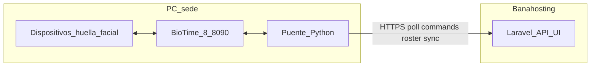

# Plan: Integracion BioTime (config por sede + puente + acceso)

> **Referencia ADR:** [adr-biotime-puente-acceso.md](../architecture/adr-biotime-puente-acceso.md)  
> **Clasificacion UI:** [adr-biotime-clasificacion.md](../architecture/adr-biotime-clasificacion.md)  
> **Prioridad:** Alta (integracion operativa multi-sede)  
> **Ultima actualizacion:** 2026-07-15  
> **Estado:** Fases 0–5 implementadas; ADR puente en estado Aceptado  
> **Hosting:** Banahosting (Laravel); BioTime 8.x local por sede (`:8085` / `:8090`)

---

## 1. Decisiones fijas

| Tema | Decision |
| --- | --- |
| Fuente de verdad de acceso | Laravel |
| Elegibilidad | Solo **matricula vigente** (tipo membresia; legacy `cliente_membresias` NO otorga acceso fisico) |
| Gracia post-vencimiento | **0 dias** (`BioTimeAccessEligibilityService`: `fecha_fin >= hoy`) |
| Alerta operativa | Dashboard BioTime por sede (`biotime.ver`); reconcile con `biotime.editar` |
| Bloqueo en BioTime | Area denegada / quitar area autorizada (conservar biometria; BioTime rechaza `area: []`) |
| Identidad | `emp_code` = `cliente.codigo` (string; no el id interno) |
| Sedes | Una instalacion BioTime + un puente Python por sucursal |
| Roster | Solo clientes de la sucursal autenticada |
| Auth puente → Laravel | Token distinto por sede |
| Transporte | Polling HTTPS saliente desde el PC de la sede (sin WebSockets) |
| Areas | Una area BioTime = una sucursal Laravel (`area_biotime_id` en settings) |
| Alta biometrica | Recepcion enrolla huella/cara solo en BioTime |
| Latencia | Hasta ~60 min aceptable; poll tipico 15–60 min |

---

## 2. Contexto y baseline

### Ya existe en Laravel

| Pieza | Ubicacion |
| --- | --- |
| Receptor sync entrante | `POST /api/biotime/sync` → `BioTimeSyncController` |
| Jobs por entidad | `ProcessBioTimeEmployees`, Areas, Devices, Departments, Transactions |
| Servicio upsert | `app/Services/BioTime/BioTimeSyncService.php` |
| Token global (singleton) | `BioTimeSetting` / `bio_time_settings` |
| Middleware | `VerifyBioTimeSyncToken` (`biotime.sync`) |
| Dashboard | `BioTimeDashboard` + mapeos area/device/dept → sucursal |
| Linking | `cliente.biotime_id`, `BioTimeEmployee.cliente_id`, `BioTimeMapping` |
| Widget Checking | Ultima sync / origen asistencia |

### Gaps (este plan los cierra)

1. Token y health **por sede** (hoy es global).
2. Modulo UI de **configuracion BioTime por sedes**.
3. API `commands` / `ack` / `roster` (Laravel → puente).
4. Regla de elegibilidad por matricula → encolar activate/deactivate.
5. Aplicativo puente Python en produccion.
6. Observabilidad operativa (heartbeat, fallos, runbook).

### Arquitectura objetivo



---

## 3. Modulo especial: configuracion BioTime por sedes

### Objetivo

Reemplazar el secret singleton por settings **por `sucursal_id`**, con UI operativa para regenerar token, fijar area BioTime de acceso y ver estado del puente.

### Tabla propuesta: `bio_time_sucursal_settings`

| Columna | Tipo | Notas |
| --- | --- | --- |
| `id` | PK | |
| `sucursal_id` | FK unique | Una fila por sede |
| `webhook_secret` | encrypted string nullable | Token del puente (`bt_…`) |
| `area_biotime_id` | unsigned int nullable | Area autorizada en BioTime |
| `biotime_base_url` | string nullable | Referencia ops (ej. `http://127.0.0.1:8090`); el puente usa YAML local |
| `poll_interval_seconds` | unsigned int default 3600 | Guia de configuracion |
| `enabled` | boolean default true | Desactiva poll/sync de esa sede |
| `last_received_at` | datetime nullable | Ultimo sync entrante |
| `last_heartbeat_at` | datetime nullable | Ultimo poll/ack exitoso |
| `timestamps` | | |

### Modelo / servicios

- `App\Models\BioTime\BioTimeSucursalSetting`
- `BioTimeSucursalSetting::forSucursal(int $id): self`
- `findBySecret(string $secret): ?self` (comparacion segura)
- `regenerateSecret(): string`

### Auth

`VerifyBioTimeSyncToken` deja de usar el singleton global: busca secret en `bio_time_sucursal_settings`, exige `enabled=true`, y adjunta al request:

- `biotime_sucursal_id`
- `biotime_sucursal_setting_id`

Compatibilidad: migracion one-shot — crear fila por cada sucursal; copiar secret de `bio_time_settings` / `BIOTIME_WEBHOOK_SECRET` a la sede `es_principal` (o la unica).

### UI

- Tab o Livewire dedicado: `BioTimeSucursalConfig` (o tab `sedes` en dashboard).
- Alcance: `SucursalContext` (usuario ve/edita sedes permitidas).
- Acciones: ver/regenerar token, set `area_biotime_id`, toggle `enabled`, mostrar heartbeat/last sync.
- Permisos: `biotime.ver` lectura; `biotime.editar` escribir/regenerar.

### Relacion con mapeos existentes

`BioTimeMapping` (area/device/dept → sucursal) **sigue** para sync de transacciones y resolucion de sede.  
`area_biotime_id` en settings es el area **de acceso fisico** que el puente asigna/quita al activate/deactivate. Debe coincidir con el mapeo area→sucursal de esa sede.

---

## 4. Como usar este plan con Cursor

1. Ejecutar fases **en orden** (0 → 5).
2. Abrir Agent en el repo `gimnacio_v1.1`.
3. Copiar el bloque **Prompt Cursor** del paso (completo).
4. Verificar criterios de aceptacion antes del siguiente paso.
5. No hacer commit salvo que se pida explicitamente.

---

## 5. Plan por fases

### Fase 0 — PoC BioTime local

**Objetivo de fase:** Validar auth + update de areas en BioTime 8 antes de tocar Laravel.

#### Paso 0.1 — Script PoC auth y areas

- **Objetivo:** Demostrar login API y PATCH de `area` en un empleado de prueba.
- **Entregable:** carpeta `tools/biotime-poc/` (script Python + README checklist).
- **Criterios de aceptacion:**
  - Token JWT/Token obtenido contra `:8090`.
  - Empleado con area asignada y luego con `area: []`.
  - Checklist firmado: terminal deja de autorizar (o documenta sync manual dispositivo).
- **Dependencias:** BioTime 8 instalado en sede piloto.

##### Prompt Cursor

```text
Contexto: repo gimnacio_v1.1. ADR docs/architecture/adr-biotime-puente-acceso.md. Plan docs/plans/08-biotime-integracion-plan.md paso 0.1.

Objetivo: Crear PoC Python minimo para BioTime 8.x local (puerto 8090) que:
1) Autentique (probar /jwt-api-token-auth/ y/o /api-token-auth/).
2) Liste/busque empleado por emp_code.
3) Asigne area (PATCH/PUT) y luego quite areas (area vacia).
4) Deje README con variables (BIOTIME_URL, USER, PASS, EMP_CODE, AREA_ID) y checklist de prueba en dispositivo.

Archivos nuevos bajo tools/biotime-poc/ (requirements.txt, main.py o scripts/, README.md).
No modifiques app Laravel en este paso.
No uses WebSockets.
No hagas commits salvo que se pida.

Criterios: README documenta comando exacto para activar/desactivar areas; maneja errores HTTP legibles.
```

---

### Fase 1 — Configuracion BioTime por sedes

**Objetivo de fase:** Token, area y health por `sucursal_id`; UI de configuracion; middleware resuelve sede.

#### Paso 1.1 — Migracion y modelo `BioTimeSucursalSetting`

- **Objetivo:** Persistencia settings por sede + seed desde secret global.
- **Archivos nuevos:** migracion, `app/Models/BioTime/BioTimeSucursalSetting.php`
- **Archivos a tocar:** posiblemente deprecar uso de `BioTimeSetting::activeSecret()` (mantener tabla legacy temporalmente o migrar lecturas).
- **Criterios de aceptacion:**
  - Una fila por sucursal existente tras migrate.
  - Secret principal copiado a sede principal.
  - Cast encrypted de `webhook_secret`.
  - Tests de modelo/factory basicos.
- **Dependencias:** Paso 0.1 (recomendado) o en paralelo si BioTime no esta listo.

##### Prompt Cursor

```text
Contexto: repo gimnacio_v1.1. Plan docs/plans/08-biotime-integracion-plan.md paso 1.1. ADR docs/architecture/adr-biotime-puente-acceso.md.

Objetivo: Crear tabla bio_time_sucursal_settings y modelo App\Models\BioTime\BioTimeSucursalSetting con:
- sucursal_id unique FK
- webhook_secret encrypted nullable
- area_biotime_id nullable
- biotime_base_url nullable
- poll_interval_seconds default 3600
- enabled default true
- last_received_at, last_heartbeat_at nullable

Migracion data: para cada sucursal crear fila; copiar secret de BioTimeSetting::current()/BIOTIME_WEBHOOK_SECRET a la sede es_principal (o unica).

Metodos: forSucursal(), findBySecret(), regenerateSecret() (prefijo bt_ + random 64).

Tests Feature/Unit que cubran regenerate y unique sucursal_id.
No cambies la UI todavia (paso 1.3).
No WebSockets. No commits salvo que se pida.
Sigue estilo strict_types y patrones del modulo BioTime existente.
```

#### Paso 1.2 — Middleware token → sede

- **Objetivo:** Auth API identifica sucursal.
- **Archivos:** `VerifyBioTimeSyncToken.php`, `BioTimeSyncController.php` (usar sucursal del request para `last_received_at`), requests si aplica.
- **Criterios de aceptacion:**
  - Token invalido → 401.
  - Token de sede disabled → 403.
  - Sync actualiza `last_received_at` de esa sede.
  - Tests Feature con dos sedes/tokens distintos.
- **Dependencias:** Paso 1.1.

##### Prompt Cursor

```text
Contexto: repo gimnacio_v1.1. Plan paso 1.2. Middleware actual: app/Http/Middleware/VerifyBioTimeSyncToken.php. Sync: BioTimeSyncController.

Objetivo: Resolver autenticacion Biotime por BioTimeSucursalSetting (secret por sede), no por singleton global.
- Bearer o X-BioTime-Secret
- Adjuntar biotime_sucursal_id y setting al request
- Rechazar enabled=false con 403
- En store/health relevante: actualizar last_received_at / heartbeat de la sede autenticada
- Mantener throttle biotime-sync

Actualizar tests existentes BioTimeSyncTest y agregar casos multi-sede.
Deprecar BioTimeSetting::activeSecret() en el path de sync (dejar metodo legacy solo si hace falta compat env durante transicion; documentar en comentario breve).
No UI. No commits salvo que se pida.
```

#### Paso 1.3 — UI modulo config por sedes

- **Objetivo:** Pantalla/tab de configuracion por sucursal.
- **Archivos:** Livewire nuevo o tab en `BioTimeDashboard`, Blade, `PermissionCatalog` si hace falta, rutas.
- **Criterios de aceptacion:**
  - Admin con `biotime.editar` regenera token y guarda `area_biotime_id`.
  - Respeta `SucursalContext` / sedes del usuario.
  - Muestra last sync / heartbeat.
  - Texto UI ya no dice “token global”.
- **Dependencias:** Paso 1.2.

##### Prompt Cursor

```text
Contexto: repo gimnacio_v1.1. Plan paso 1.3. Dashboard actual: app/Livewire/BioTime/BioTimeDashboard.php y vistas livewire/biotime/*.

Objetivo: Crear modulo UI de configuracion BioTime por sedes (tab "sedes" o componente BioTimeSucursalConfig) que permita por sucursal:
- ver/copiar token (solo quien biotime.editar tras regenerar o con confirmacion)
- regenerar token
- editar area_biotime_id, biotime_base_url, poll_interval_seconds, enabled
- ver last_received_at y last_heartbeat_at

Usa SucursalContext / sedes permitidas del usuario. Permisos biotime.ver / biotime.editar.
Preserva tabs existentes (dashboard, mapping, history, security legacy o redirige security al nuevo tab).
Estilo visual alineado al dashboard actual (no rediseñar todo el sitio).
Feature test Livewire basico de regenerar secret.
No implementes commands API todavia. No commits salvo que se pida. Responde en codigo claro; sin docs markdown nuevos.
```

---

### Fase 2 — API de comandos (Laravel → puente)

**Objetivo de fase:** El puente puede bajar trabajo pendiente y devolver ACK; roster para reconciliacion.

#### Paso 2.1 — Tablas `bio_time_access_commands` (+ estado deseado opcional)

- **Objetivo:** Cola durable de activate/deactivate.
- **Schema sugerido:**
  - `id`, `sucursal_id`, `cliente_id`, `emp_code`, `action` (`activate`|`deactivate`), `desired_area_biotime_id` nullable, `status` (`pending`|`processing`|`acked`|`failed`), `attempts`, `last_error`, `acked_at`, timestamps; indices por (`sucursal_id`,`status`).
- **Criterios:** migracion + modelo + factory; unique idempotencia recomendada: no duplicar pending iguales para mismo cliente/sede/action.
- **Dependencias:** Fase 1.

##### Prompt Cursor

```text
Contexto: repo gimnacio_v1.1. Plan docs/plans/08-biotime-integracion-plan.md paso 2.1.

Objetivo: Crear migracion y modelo BioTimeAccessCommand (tabla bio_time_access_commands) con campos:
sucursal_id, cliente_id, emp_code, action enum activate|deactivate, desired_area_biotime_id nullable,
status pending|processing|acked|failed, attempts default 0, last_error nullable, acked_at nullable.

Indices: (sucursal_id, status), (cliente_id, sucursal_id).
Helper en modelo o servicio stub BioTimeAccessCommandService::enqueue(sucursal, cliente, action) que evite duplicar pending identicos.
Factory + test unitario de enqueue idempotente.
No endpoints HTTP todavia (paso 2.2). No commits salvo que se pida.
```

#### Paso 2.2 — Endpoints `commands`, `ack`, `roster`

- **Objetivo:** Contrato HTTP para el puente.
- **Rutas (API, middleware `biotime.sync` + throttle):**
  - `GET /api/biotime/commands` → pendientes de la sede del token (limit, marca processing o deja pending hasta ack).
  - `POST /api/biotime/commands/{id}/ack` → body `{ "status": "acked"|"failed", "error": "..."? }`, actualiza heartbeat.
  - `GET /api/biotime/roster` → lista `{ emp_code, cliente_id, active, area_biotime_id? }` solo clientes de la sede.
- **Criterios:** tests Feature; token de sede A no ve comandos de sede B; roster vacio si enabled false → 403.
- **Dependencias:** Paso 2.1.

##### Prompt Cursor

```text
Contexto: repo gimnacio_v1.1. Plan paso 2.2. Auth por sede ya en VerifyBioTimeSyncToken.

Objetivo: Implementar API:
- GET /api/biotime/commands
- POST /api/biotime/commands/{id}/ack
- GET /api/biotime/roster

Controller dedicado (ej. BioTimeBridgeController) + Form Requests.
commands: solo status pending de biotime_sucursal_id del token; opcional limit=100; al entregar puedes marcar processing.
ack: solo si el comando pertenece a esa sede; acked o failed; incrementa attempts en failed; set last_heartbeat_at del setting.
roster: clientes de esa sucursal con flag active segun regla provisional: existe matricula vigente (implementacion minima o stub que llama servicio vacio documentado — si BioTimeAccessEligibilityService aun no existe, calcula inline: cliente_matriculas tipo membresia, estado activa, fecha_inicio<=hoy, fecha_fin null o >=hoy, misma sucursal_id). emp_code = cliente.codigo.

Tests Feature exhaustivos multi-sede.
Actualizar /api/biotime/health para listar los nuevos endpoints.
No puente Python. No commits salvo que se pida.
```

---

### Fase 3 — Elegibilidad y encolado automatico

**Objetivo de fase:** Laravel decide quien debe entrar y encola comandos.

#### Paso 3.1 — `BioTimeAccessEligibilityService`

- **Objetivo:** Unica funcion `isEligible(Cliente $cliente, int $sucursalId): bool`.
- **Regla fija:** true solo si existe `ClienteMatricula` con `tipo = membresia`, `estado = activa`, vigencia de fechas, y pertenece a esa sucursal (via `cliente.sucursal_id` o campo de matricula si existe — alinear con modelo real).
- **No contar** `cliente_membresias` legacy.
- **Criterios:** tests: vigente, vencida, congelada, otra sucursal, sin matricula.
- **Dependencias:** Paso 2.2.

##### Prompt Cursor

```text
Contexto: repo gimnacio_v1.1. Plan paso 3.1. Modelo ClienteMatricula en app/Models/Core/ClienteMatricula.php.

Objetivo: Crear App\Services\BioTime\BioTimeAccessEligibilityService con:
- isEligible(Cliente $cliente, int $sucursalId): bool
- listEligibleClienteIds(int $sucursalId): Collection|array

Regla: SOLO matricula vigente (tipo membresia, estado activa, fechas vigentes). Legacy cliente_membresias NO otorga acceso.
Un cliente solo es eligible en su sucursal (cliente.sucursal_id == sucursalId salvo que el dominio tenga otro vinculo documentado en codigo).

Tests Feature/Unit con casos: activa vigente, vencida, congelada, otra sede, sin matricula.
Reusa estilos de servicios existentes. Actualiza /api/biotime/roster para usar este servicio (quitar logica inline del paso 2.2).
No commits salvo que se pida.
```

#### Paso 3.2 — Sync deseado → comandos (job + hooks)

- **Objetivo:** Al cambiar elegibilidad, encolar activate/deactivate.
- **Archivos:** Job `ReconcileBioTimeAccessForSucursal` (schedule hourly), listeners/hooks al activar/pagar/cambiar estado de matricula, `BioTimeAccessCommandService`.
- **Criterios:**
  - Schedule registrado en `routes/console.php` o Kernel schedule.
  - Activate usa `area_biotime_id` del setting de la sede.
  - Deactivate con `desired_area_biotime_id` null.
  - Tests de reconcile neto (eligible ↔ comando).
- **Dependencias:** Paso 3.1.

##### Prompt Cursor

```text
Contexto: repo gimnacio_v1.1. Plan paso 3.2.

Objetivo:
1) Completar BioTimeAccessCommandService::reconcileSucursal(int $sucursalId): compara elegibles vs ultimo estado deseado / employees known y encola activate/deactivate faltantes.
2) Job ReconcileBioTimeAccessForSucursal + schedule cada hora (o intervalo configurable).
3) Hook al guardar ClienteMatricula (observer o en ClienteMatriculaService) para encolar reconcile del cliente/sede afectada (sin bloquear request: dispatch job).
4) Si BioTimeSucursalSetting.enabled=false, no encolar.

Tests: cliente pasa a vencido → comando deactivate pending; pago reactiva → activate.
No implementes el puente Python. No WebSockets. No commits salvo que se pida.
```

---

### Fase 4 — Puente Python

**Objetivo de fase:** Servicio en el PC de la sede que aplica areas en BioTime y empuja sync entrante.

#### Paso 4.1 — Estructura app puente

- **Objetivo:** Proyecto Python instalable (`tools/biotime-bridge/` o repo sibling documentado aqui).
- **Config YAML por sede:** `laravel_base_url`, `token`, `biotime_base_url`, `biotime_user`, `biotime_password`, `area_id`, `poll_seconds`, `sucursal_codigo`.
- **Modulos:** auth BioTime, client Laravel, apply command (PATCH employee areas), poll loop, sync push (reuse payload shape de `BioTimeSyncRequest`).
- **Criterios:** README instalacion Windows; dry-run mode; logs a archivo.
- **Dependencias:** Fase 2+3 en staging/local Laravel.

##### Prompt Cursor

```text
Contexto: repo gimnacio_v1.1. Plan paso 4.1. PoC previo en tools/biotime-poc/ si existe. Contrato API:
GET /api/biotime/commands, POST ack, GET roster, POST /api/biotime/sync (auth Bearer token sede).

Objetivo: Crear aplicacion puente Python en tools/biotime-bridge/ con:
- config.yaml.example
- loop: poll commands → aplicar en BioTime (activate=asignar area_id; deactivate=area []) buscando empleado por emp_code=cliente.codigo → ack
- reconcile periodico con roster (opcional flag)
- push sync de employees/transactions basico reutilizando forma JSON del sync Laravel (puede empezar solo employees)
- logging, retries con backoff, dry_run
- README: instalar deps, Task Scheduler / NSSM en Windows, variables

Emp_code es string del cliente.codigo Laravel. No WebSockets. No tocar PHP salvo documentar URLs.
Requirements.txt con httpx o requests.
No commits salvo que se pida.
```

#### Paso 4.2 — Empaquetado operativo Windows

- **Objetivo:** Correr como servicio/tarea programada + health local.
- **Criterios:** script `install-task.ps1` o instrucciones NSSM; archivo log rotativo; exit codes claros.
- **Dependencias:** Paso 4.1.

##### Prompt Cursor

```text
Contexto: plan paso 4.2. App en tools/biotime-bridge/.

Objetivo: Añadir scripts Windows (PowerShell) para registrar Task Scheduler que ejecuta el puente cada minuto O proceso continuo con restart on failure.
Documentar en README: copiar config.yaml, regenerar token desde UI Laravel por sede, verificar primer poll (last_heartbeat_at).
Añadir comando CLI `python -m bridge doctor` que verifique conectividad Laravel health + BioTime token.
No cambios Laravel. No commits salvo que se pida.
```

---

### Fase 5 — UI operativa, runbook y endurecimiento

**Objetivo de fase:** Operacion diaria sin SSH; alertas basicas.

#### Paso 5.1 — Panel operacional

- **Objetivo:** En BioTime dashboard: heartbeat por sede, comandos failed, desvio roster (conteo).
- **Criterios:** visible con `biotime.ver`; CTA a re-encolar reconcile.
- **Dependencias:** Fase 4 en piloto.

##### Prompt Cursor

```text
Contexto: plan paso 5.1. Settings por sede y commands ya existen.

Objetivo: Extender BioTimeDashboard (tab dashboard o sedes) para mostrar por sucursal:
- enabled, last_heartbeat_at, last_received_at
- conteo commands pending / failed (24h)
- aviso visual si heartbeat > 2 horas

Boton "Reconciliar acceso" (biotime.editar) que dispatch ReconcileBioTimeAccessForSucursal.
Feature test smoke del render.
No rediseñar branding global. No commits salvo que se pida.
```

#### Paso 5.2 — Runbook recepcion + ADR accept

- **Objetivo:** Documentar operacion y cerrar preguntas del ADR.
- **Archivos:** seccion Runbook al final de este plan (completar) + actualizar estado ADR a Aceptado cuando piloto OK.
- **Criterios:** checklist de alta cliente; que hacer si no abre; rotacion de token.
- **Dependencias:** Paso 5.1.

##### Prompt Cursor

```text
Contexto: plan paso 5.2. ADR docs/architecture/adr-biotime-puente-acceso.md.

Objetivo: Actualizar el ADR (estado Aceptado si el piloto paso) quitando preguntas abiertas ya resueltas:
- elegibilidad = matricula vigente tipo membresia o clase; create-if-missing; cupo 500 con purge destructivo de clientes inelegibles
- gracia = 0 dias (salvo que el codigo implemente otra; documentar la real)
- alerta = visible en dashboard BioTime (admin/biotime.ver)

Añadir al final de docs/plans/08-biotime-integracion-plan.md seccion "Avance de implementacion" marcando fases hechas.
No refactor de codigo no relacionado. Commit solo si el usuario lo pide.
```

---

## 6. Contrato API (referencia rapida)

### Auth

```http
Authorization: Bearer <webhook_secret_sede>
# o
X-BioTime-Secret: <webhook_secret_sede>
```

### Sync entrante (existente)

`POST /api/biotime/sync` — body `{ "entity", "timestamp", "data": [ ... ] }`

### Commands (nuevo)

`GET /api/biotime/commands` → `{ "data": [ { "id", "emp_code", "action", "desired_area_biotime_id" } ] }`

`POST /api/biotime/commands/{id}/ack` → `{ "status": "acked"|"failed", "error": null }`

### Roster (nuevo)

`GET /api/biotime/roster` → `{ "data": [ { "cliente_id", "emp_code", "active" } ] }`

---

## 7. Runbook operativo

### Alta de cliente con acceso biometrico

1. Crear/activar cliente y matricula vigente en Laravel (sucursal correcta; con **codigo** asignado).
2. Asegurar `emp_code` = `cliente.codigo` en BioTime (recepcion crea persona con ese codigo si no existe).
3. Enrollar huella/cara en BioTime.
4. Esperar reconcile/comando `activate` (o forzar "Reconciliar acceso") → area de la sede asignada.
5. Probar marcacion en dispositivo.

> Tras unificar identidad: si quedaron commands pending con `emp_code` = id numerico antiguo, fallaran en BioTime. Usa **Reconciliar acceso** para re-encolar con el codigo correcto (o marca esos failed a mano).

### Cliente vencido

1. Matricula deja de estar vigente → job encola `deactivate`.
2. Puente quita areas → dispositivo deja de autorizar (tras sync BioTime→terminal).

### Puente caido

1. Dashboard: heartbeat > 2 h en rojo.
2. Verificar PC, BioTime, Task Scheduler, token no regenerado a medias.
3. `bridge doctor` en la sede.
4. Reconciliar al recuperar.

### Rotar token

1. UI config sede → Regenerar.
2. Actualizar `config.yaml` del puente → reiniciar servicio.
3. Confirmar heartbeat nuevo.

---

## 8. Riesgos y mitigaciones

| Riesgo | Mitigacion |
| --- | --- |
| Quitar area no baja al dispositivo | PoC 0.1 + sync manual/API terminales documentada |
| Banahosting sin queue worker | Preferir sync síncrono o `schedule:run` via cron hosting |
| Colision emp_code con staff BioTime | Departamento/area Clientes; no reutilizar codigos de empleados |
| Secret global viejo en agentes | Migracion one-shot + UI deja claro token por sede |
| Matriculas legacy siguen "activas" en UI comercial | Elegibilidad ignora legacy; comunicar a recepcion |
| Multi-PC / multi-BioTime mal token | Token por sede; tests cross-sede |

---

## 9. Orden de PRs sugerido

1. PoC tools (puede ir separado).
2. Settings por sede + middleware + UI config.
3. Commands/ack/roster + modelos.
4. Eligibility + reconcile job/hooks.
5. Puente Python + scripts Windows.
6. Panel operacional + ADR aceptado.

---

## 10. Checklist global de cierre

- [ ] PoC areas ↔ dispositivo OK en sede piloto (validacion en terminal)
- [x] Token por sede en UI y API
- [x] Commands/ack/roster testeados multi-sede
- [x] Elegibilidad solo matricula vigente (gracia 0 dias)
- [x] Puente empaquetado (`tools/biotime-bridge` + scripts Task Scheduler)
- [ ] Activate/deactivate refleja en terminal ≤ poll_interval (ops sede)
- [x] Heartbeat visible; alerta > 2 h en dashboard
- [ ] Runbook usado por recepcion al menos una vez
- [x] ADR puente en estado Aceptado

---

## 11. Avance de implementacion

Actualizado: 2026-07-15.

| Fase | Estado | Notas |
| --- | --- | --- |
| 0 PoC | Hecho (script) | `tools/biotime-poc/`; validacion area→dispositivo en terminal queda a ops de sede |
| 1 Config por sede | Hecho | `bio_time_sucursal_settings`, middleware token→sede, UI Sedes |
| 2 API commands | Hecho | `commands` / `ack` / `roster` + tests Feature |
| 3 Elegibilidad | Hecho | Solo matricula vigente; gracia **0 dias**; job reconcile + hook matricula |
| 4 Puente Python | Hecho | `tools/biotime-bridge` (poll, areas, ack, roster, scripts Windows) |
| 5 Ops / ADR | Hecho | Panel operacional (5.1); ADR **Aceptado** + runbook + este avance (5.2) |

Decisiones cerradas en ADR / codigo:

- Elegibilidad = solo matricula vigente (no legacy).
- Gracia = 0 dias (`BioTimeAccessEligibilityService`).
- Alerta = dashboard BioTime (`biotime.ver`); CTA reconcile (`biotime.editar`).

---

## 12. Relacion con otros planes

- [00-operaciones-plan-mejora.md](./00-operaciones-plan-mejora.md) Fase 3 BioTime/checking — este plan **extiende** el acceso fisico; no reemplaza el widget de Checking.
- [06-administracion-plan-mejora.md](./06-administracion-plan-mejora.md) — navegacion BioTime ya en Operaciones via ADR clasificacion.
- [99-transversal-plan-mejora.md](./99-transversal-plan-mejora.md) — multi-sucursal / `SucursalContext` son prerequisito de la UI por sede.
